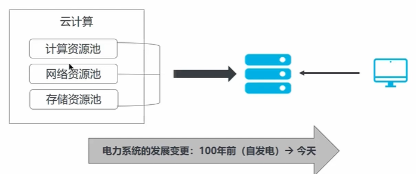
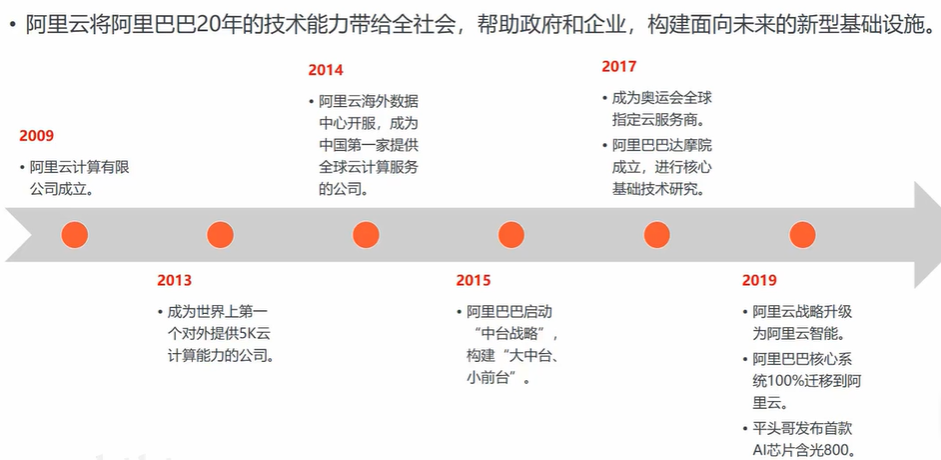
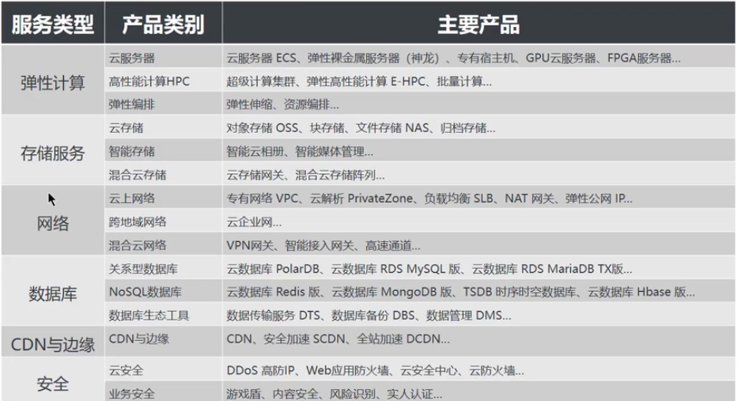
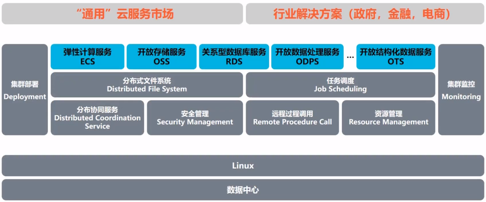
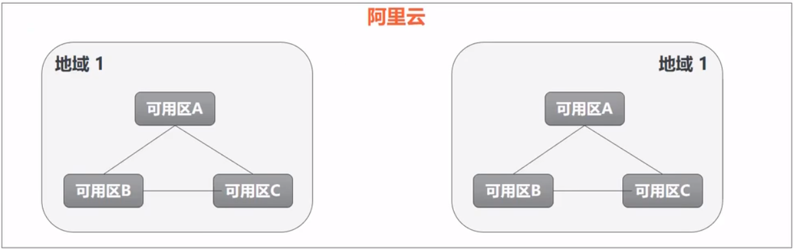

ACA云计算：

1.阿里云简介

目标：

1.了解云计算的概念。

2.理解云计算的部署模式和服务模式。

3.熟悉阿里云云计算产品。

4.掌握阿里云中地域和可用区的概念。

1.1 云计算的概念

传统IT部署方式—自建机房。

机房：电力、空调、机柜

硬件：服务器、交换机、路由器、防火墙、IPS、IDS

软件：操作系统、网站服务器软件、数据

人员：施工、维护、数据库管理员、系统管理员、网络管理员。

云计算是一种新的服务模式——购买服务。

云计算部署模式：

云计算按照拥有者和使用者的不同主要分为下面三种部署模式：

- 专有云：私有云，属于企业内部自行构建的云环境。
- 公有云：云服务商提供云计算服务，用户通过互联网进行连接和使用
- 混合云：企业内部云和公有云互通，具有私有云的私密性兼具公有云的灵活性。

云计算根据对用户所提供的服务不同划分了多种不同的服务模式，最常见的服务模式主要有三种：

- IaaS：
  - 基础设施即服务，为用户直接提供计算资源、存储资源、网络资源等。
  - 只为用户提供相应资源，用户需要自行构建自身系统，可操纵性最高。一般云服务商都会提供该服务模式。	

- PaaS：
  - 平台即服务，为开发者提供按需开发环境。
  - 主要针对开发者用户提供一个开发、测试等使用云环境。

- SaaS：
  - 软件即服务，为用户提供按需软件服务。
  - 云服务商管理和提供软件，用户直接使用云服务商软件。

1.2 阿里云发展历程

阿里云创立于2009年，2017年1月成为奥运会全球指定云服务商。

2.阿里云云产品

2.1 阿里云云产品全家福

计算类：

​	阿里云弹性计算类产品主要为用户提供计算相关的服务，最常用的**弹性计算类**产品有：

- 云服务器ECS：安全型、内存型、进阶型到入门型的的云服务器

- 弹性裸金属服务器（神龙）：兼具虚拟机的弹性和物理机的高性能、安全物理隔离、分钟交付、云产品全兼容。

- 超级计算集群：支持RDMA 提供极致并行计算性能实例规格。

- 弹性伸缩：自动调整弹性计算资源的管理服务。

存储类：

​	阿里云存储类产品主要为用户提供数据存储类服务。最常用的存储类产品有：

- 对象存储OSS：比传统存储成本下降25%~75%的强安全企业级存储。

- 块存储：可弹性扩展、高性能、高可靠的块级随机存储。

- 文件存储NAS：支持NFS、CIFS 协议的可共享文件存储。

- 云存储网关：可在线下和云上部署的软网关。

- 混合云存储阵列：集成了阿里云云存储网关的企业级统一存储阵列。

网络类：

​	阿里云网络类产品主要为用户提供阿里云内资源互通以及云内资源和公网连接。

​	最常用的网络类产品有：

- 专有网络VPC：构建逻辑隔离网络，确保资源安全。

- 负载均衡SLB：对多台云服务器进行流量分发的负载均衡服务

- NAT网关：支持NAT转发、共享带宽的VPC网关。

- 弹性公网IP：独立的公网IP资源

- 云企业网：帮助用户打造具有企业级规模和通信能力的云上网络。

- VPN网关：安全加密的云上云下数据互通方案。

数据库类产品：

​	阿里云数据库类产品主要为用户提供数据库解决方案。最常用的数据库类产品有：

- 云数据库PolarDB：自研全新一代云数据库。

- 云数据库RDS MySql 版

- 数据传输服务DTS

- 数据管理DMS

安全类：

​	阿里云安全类产品主要为保护用户数据和业务的安全，最常用的安全类产品有：

- DDos高防IP：300G按天服务，防御超大流程DDos攻击。

- Web应用防火墙：防注入，防CC，一站式Web安全解决方案。

- 云防火墙：基于业务可视的结果、实现业务梳理和业务隔离。

- 云安全中心（安骑士）：全方位服务器安全检测、相应和防护。

2.2 阿里云产品架构

3.阿里云的基础架构

3.1 地域和可用区

- 地域(Region)是阿里云基于地理位置进行划分，资源创建成功后不能修改地域。不同地域的阿里云资源也会略有不同。

- 可用区（Zone）是指在同一地域内，电力和网络互相独立的物理区域。同一可用区内实例之间的网络延时更小。

资源多地域或多可用区部署？——提高多可用性

地域和可用区的关系。

每个地域完全独立。每个可用区完全隔离，但同一个地域内的可用区之间使用低时延链路相连。

如何选择合适的地域和可用区？

选择地域时，需要考虑的因素：

- ​	地理位置：根据目标用户所在的地理位置选择地域。

- ​	阿里云产品之间的关系

- ​	资源的价格

- ​	经营许可证备案

选择可用区时，需要考虑的因素：

- ​	在同一地域内可用区与可用区之间内网互通，可用区之间能做到故障隔离。是否将实例放在同一可用区内，主要取决于对容灾能力和网络延时的要求。

完整的服务体系：

- 全天候的工单支持体系

- 唾手可得的自助服务—帮助中心

- 共建互助的开发者社区

- 多元化的合作生态—服务市场

- 完整专业的培训认证

------

### 阿里云弹性计算

目标：

1.理解阿里云云服务器ECS的概念

2.了解ECS的使用场景和实例规格

3.理解阿里云弹性裸金属服务器EBM的特点

4.掌握EBM的特点

5.理解创建和使用ECS

**阿里云云服务器ECS的概念**

阿里云云服务器ECS：

- 云服务器（Elastic Compute Service，ECS）是阿里云提供的性能卓越、稳定可靠、弹性扩展的IaaS（Infrastructure as a Service）级别云计算服务。

- 云服务器ECS免去了采购IT硬件的前期准备，像使用水、电、天然气等公共资源一样便携、高效地使用服务器，实现计算资源的即开即用和弹性伸缩。阿里云ECS持续提供创新型服务器，解决多种业务需求，助力企业的业务发展。

ECS的组件架构图：

云服务ECS及其他阿里云产品关系如图。

ECS部署建议：

阿里云ECS在部署前需要进行规划，需要考虑的因素主要有：

地域和可用区、高可用性、网络规划、安全方案。

ECS适用场景：

1.企业官网或轻量的Web应用

2.多媒体以及高并发应用或网站

3.高I/O要求数据库

4.访问量波动剧烈的应用或网站

5.大数据及实时在线或离线分析

6.机器学习和深度学习等AI应用

**ECS的优势**

阿里云弹性计算10年身后技术积淀，技术领先、性能优异、稳如磐石。

**ECS和IDC对比：**

**ECS的实例规格**

ECS的常用概念：

实例：一台云服务器ECS实例等同于一台虚拟机，包含vCPU、内存、操作系统、网络、磁盘等最寄出的计算组件，可以方便的定制、更改实例的配置。

实例规格：根据业务场景，ECS实例可以分为多个规格族，同一个规格族里，根据vCPU和内存的配置，可以分为多种不同的规格。不同实例规格具有不同的vCPU和内存等配置，包括物理CPU型号、主频等。某些软件或应用对实例规格的配置有要求。

系统存储：一台EC实例必须包含一块系统盘，用来存储操作系统和核心配置。镜像主要用于初始化系统盘，决定ECS实例的操作系统和初始软件配置。

网络类型：ECS实例区分网络类型。实例在相同的网络中，例如同一个VPC，可以使用私网IP地址通过内网通信。

实例的生命周期：

创建实例—准备中—启动中—运行中—停止中—已停止—删除实例。

**阿里云中ECS的实例规格族：**

弹性裸金属服务器（神龙）EBM

- EBM的概念

- EBM的优势和使用场景

弹性裸金属服务器（神龙）概念：

​	弹性裸金属服务器（ECS Bare Metal Instance） 是基于达礼运完全自主研发的下一代虚拟化技术而打造的新型计算类服务产品，兼具虚拟机的弹性和物理机的性能及功能特性。与上一代虚拟化技术相比，下一代虚拟化技术不仅保留了普通云服务器的弹性体验，而且保证了物理机的性能与特性，全面**支持嵌套虚拟化**技术。

弹性裸金属服务器特点：

- 弹性裸金属服务器融合了物理机与云服务器的各自优势，实现超强超稳的计算能力。业务应用可以直接访问弹性裸金属服务器和内存，无任何虚拟化开销。
- 弹性裸金属服务器通过自研芯片和自研Hypervisor系统软件，打造了全球领先的深度融合物理机和虚拟机特性的创新型计算架构。能与阿里云产品家族中的其他计算产品无缝对接。

弹性裸金属服务器的优势和使用场景

