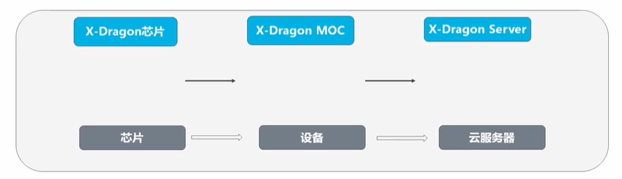

目标一：

a.了解云计算的概念。

b.理解云计算的部署模式和服务模式。

c.熟悉阿里云云计算产品。

d.掌握阿里云中地域和可用区的概念。

### 1.云计算的概念

#### 1.1.1云计算的概念

传统IT部署方式—自建机房。

机房：电力、空调、机柜

硬件：服务器、交换机、路由器、防火墙、IPS、IDS

软件：操作系统、网站服务器软件、数据

人员：施工、维护、数据库管理员、系统管理员、网络管理员。

云计算是一种新的服务模式——购买服务。

#### 1.1.2云计算部署模式：

云计算按照拥有者和使用者的不同主要分为下面三种部署模式：

- 专有云：私有云，属于企业内部自行构建的云环境。
- 公有云：云服务商提供云计算服务，用户通过互联网进行连接和使用
- 混合云：企业内部云和公有云互通，具有私有云的私密性兼具公有云的灵活性。

云计算根据对用户所提供的服务不同划分了多种不同的服务模式，最常见的服务模式主要有三种：

- IaaS：
  - 基础设施即服务，为用户直接提供计算资源、存储资源、网络资源等。
  - 只为用户提供相应资源，用户需要自行构建自身系统，可操纵性最高。一般云服务商都会提供该服务模式。	

- PaaS：
  - 平台即服务，为开发者提供按需开发环境。
  - 主要针对开发者用户提供一个开发、测试等使用云环境。

- SaaS：
  - 软件即服务，为用户提供按需软件服务。
  - 云服务商管理和提供软件，用户直接使用云服务商软件。

#### 1.2 阿里云发展历程

阿里云创立于2009年，2017年1月成为奥运会全球指定云服务商。

#### 1.3阿里云产品全家福

计算类：

​	阿里云弹性计算类产品主要为用户提供计算相关的服务，最常用的**弹性计算类**产品有：

- 云服务器ECS：安全型、内存型、进阶型到入门型的的云服务器

- 弹性裸金属服务器（神龙）：兼具虚拟机的弹性和物理机的高性能、安全物理隔离、分钟交付、云产品全兼容。

- 超级计算集群：支持RDMA 提供极致并行计算性能实例规格。

- 弹性伸缩：自动调整弹性计算资源的管理服务。

存储类：

​	阿里云存储类产品主要为用户提供数据存储类服务。最常用的存储类产品有：

- 对象存储OSS：比传统存储成本下降25%~75%的强安全企业级存储。

- 块存储：可弹性扩展、高性能、高可靠的块级随机存储。

- 文件存储NAS：支持NFS、CIFS 协议的可共享文件存储。

- 云存储网关：可在线下和云上部署的软网关。

- 混合云存储阵列：集成了阿里云云存储网关的企业级统一存储阵列。

网络类：

​	阿里云网络类产品主要为用户提供阿里云内资源互通以及云内资源和公网连接。

​	最常用的网络类产品有：

- 专有网络VPC：构建逻辑隔离网络，确保资源安全。

- 负载均衡SLB：对多台云服务器进行流量分发的负载均衡服务

- NAT网关：支持NAT转发、共享带宽的VPC网关。

- 弹性公网IP：独立的公网IP资源

- 云企业网：帮助用户打造具有企业级规模和通信能力的云上网络。

- VPN网关：安全加密的云上云下数据互通方案。

数据库类产品：

​	阿里云数据库类产品主要为用户提供数据库解决方案。最常用的数据库类产品有：

- 云数据库PolarDB：自研全新一代云数据库。

- 云数据库RDS MySql 版

- 数据传输服务DTS

- 数据管理DMS

安全类：

​	阿里云安全类产品主要为保护用户数据和业务的安全，最常用的安全类产品有：

- DDos高防IP：300G按天服务，防御超大流程DDos攻击。

- Web应用防火墙：防注入，防CC，一站式Web安全解决方案。

- 云防火墙：基于业务可视的结果、实现业务梳理和业务隔离。

- 云安全中心（安骑士）：全方位服务器安全检测、相应和防护。

#### 1.4 阿里云产品架构

#### 1.5阿里云基础架构

地域和可用区

- 地域(Region)是阿里云基于地理位置进行划分，资源创建成功后不能修改地域。不同地域的阿里云资源也会略有不同。
- 可用区（Zone）是指在同一地域内，电力和网络互相独立的物理区域。同一可用区内实例之间的网络延时更小。

资源多地域或多可用区部署？——提高多可用性

地域和可用区的关系。

每个地域完全独立。每个可用区完全隔离，但同一个地域内的可用区之间使用低时延链路相连。

如何选择合适的地域和可用区？

选择地域时，需要考虑的因素：

- ​	地理位置：根据目标用户所在的地理位置选择地域。

- ​	阿里云产品之间的关系

- ​	资源的价格

- ​	经营许可证备案

选择可用区时，需要考虑的因素：

- ​	在同一地域内可用区与可用区之间内网互通，可用区之间能做到故障隔离。是否将实例放在同一可用区内，主要取决于对容灾能力和网络延时的要求。

完整的服务体系：

- 全天候的工单支持体系
- 唾手可得的自助服务—帮助中心
- 共建互助的开发者社区
- 多元化的合作生态—服务市场
- 完整专业的培训认证

------

目标二：

a.理解阿里云云服务器ECS的概念

b.了解ECS的使用场景和实例规格

c.理解阿里云弹性裸金属服务器EBM的特点

d.掌握EBM的特点

e.理解创建和使用ECS

f.阿里云ECS的产品优势

g.阿里云ECS的实例规格

h.阿里云弹性裸金属服务器（神龙）

i.阿里云OSS的概念

### 2.阿里云ECS

#### 2.1阿里云ECS的概念

阿里云云服务器ECS：

- 云服务器（Elastic Compute Service，ECS）是阿里云提供的性能卓越、稳定可靠、弹性扩展的IaaS（Infrastructure as a Service）级别云计算服务。

- 云服务器ECS免去了采购IT硬件的前期准备，像使用水、电、天然气等公共资源一样便携、高效地使用服务器，实现计算资源的即开即用和弹性伸缩。阿里云ECS持续提供创新型服务器，解决多种业务需求，助力企业的业务发展。

ECS的组件架构图：

云服务ECS及其他阿里云产品关系如图。

ECS部署建议：

阿里云ECS在部署前需要进行规划，需要考虑的因素主要有：

地域和可用区、高可用性、网络规划、安全方案。

ECS适用场景：

1.企业官网或轻量的Web应用

2.多媒体以及高并发应用或网站

3.高I/O要求数据库

4.访问量波动剧烈的应用或网站

5.大数据及实时在线或离线分析

6.机器学习和深度学习等AI应用

#### 2.2ECS的优势

阿里云弹性计算10年身后技术积淀，技术领先、性能优异、稳如磐石。

**ECS和IDC对比：**

#### 2.3 ECS的实例规格

ECS的常用概念：

实例：一台云服务器ECS实例等同于一台虚拟机，包含vCPU、内存、操作系统、网络、磁盘等最寄出的计算组件，可以方便的定制、更改实例的配置。

实例规格：根据业务场景，ECS实例可以分为多个规格族，同一个规格族里，根据vCPU和内存的配置，可以分为多种不同的规格。不同实例规格具有不同的vCPU和内存等配置，包括物理CPU型号、主频等。某些软件或应用对实例规格的配置有要求。

系统存储：一台EC实例必须包含一块系统盘，用来存储操作系统和核心配置。镜像主要用于初始化系统盘，决定ECS实例的操作系统和初始软件配置。

网络类型：ECS实例区分网络类型。实例在相同的网络中，例如同一个VPC，可以使用私网IP地址通过内网通信。

实例的生命周期：

创建实例—准备中—启动中—运行中—停止中—已停止—删除实例。

**阿里云中ECS的实例规格族：**

#### 2.4 弹性裸金属服务器（神龙）EBM

弹性裸金属服务器（神龙）概念：

​	弹性裸金属服务器（ECS Bare Metal Instance） 是基于达礼运完全自主研发的下一代虚拟化技术而打造的新型计算类服务产品，兼具虚拟机的弹性和物理机的性能及功能特性。与上一代虚拟化技术相比，下一代虚拟化技术不仅保留了普通云服务器的弹性体验，而且保证了物理机的性能与特性，全面**支持嵌套虚拟化**技术。

弹性裸金属服务器特点：

- 弹性裸金属服务器融合了物理机与云服务器的各自优势，实现超强超稳的计算能力。业务应用可以直接访问弹性裸金属服务器和内存，无任何虚拟化开销。
- 弹性裸金属服务器通过自研芯片和自研Hypervisor系统软件，打造了全球领先的深度融合物理机和虚拟机特性的创新型计算架构。能与阿里云产品家族中的其他计算产品无缝对接。

弹性裸金属服务器的优势和使用场景

#### 2.5 阿里云ECS的使用

#####   2.5.1 ECS购买的流程

实例的创建：基础配置—网络—系统配置—完成购买

阿里云中的镜像

- ECS镜像提供了创建ECS实例所需的信息，创建ECS时，必须选择镜像。镜像文件相当于副本文件，该副本文件包含了一块或多块云盘中的所有数据，对于ECS而言，这些云盘可以是单块系统盘，也可以是系统盘加数据盘的组合。

- 阿里云中ECS使用的镜像的分类：

ECS的连接方式：

云服务器ECS支持通过多种方式连接实例，包括Workbench、VNC和第三方客户端工具。

VNC连接不需要公网IP，其余均需要固定公网IP或EIP。

重置实例密码：

​	如果主机密码遗忘，如何或者主机的控制权？

​	—重置密码功能

------

目标：

a.理解对象存储的概念

b.了解存储空间和对象的概念

c.理解阿里云对象存储OSS的优势和适用场景

d.理解块存储的概念

e.掌握阿里云中使用块存储

### 3.阿里云存储

#### 3.1阿里云对象存储OSS的概念

常见的存储结构：

​	在计算机使用过程中，经常会遇到下面三种存储结构。

阿里云对象存储OSS（Object Storage Service）时阿里云提供的海量、安全、低成本、高可靠的云存储服务。可以在任何应用、任何时间、任何地点存储和访问任意类型的数据。

OSS中的概念：

#### 3.2 OSS的优势和使用场景

阿里云OSS的优势主要有：

方便快捷的使用方式、强大灵活的安全机制、丰富强大的增值服务、数据冗余机制

阿里云OSS对比自建对象存储：

#### 3.3如何使用阿里云OSS

##### 3.3.1阿里云OSS可以使用管理控制台完成OSS的基本操作，操作流程如下：

开通OSS服务—创建存储空间—上传文件—下载文件—删除文件—删除存储空间

阿里云OSS将数据文件以对象(Object)的形式上传到存储空间(Bucket)中。可以进行以下操作：
1.创建一个或者多个存储空间，向每个存储空间中添加个或多个文件。
2.通过获取已上传文件的地址进行文件的分享和下载。
3.通过修改存储空间或文件的读写权限(ACL)来设置访问权限。
4.通过阿里云管理控制台、各种便捷工具以及丰富的SDK包执行基本和高级OSS操作。

##### 3.3.2创建存储空间：

开通阿里云OSS服务后，需要首先创建存储空间（Bucket）来存储文件。

创建存储空间时，常用的配置如下：

Bucket 名称是唯一的，不能重复。

ECS和OSS地域保持一致，保证能够内网访问。

##### 3.3.3上传对象文件

创建了存储空间（Bucket）后，可以上传任何类型的文件（Object）到存储空间中。

在阿里云上传对象文件的方法主要有：（同名文件会覆盖）

#### 3.4 阿里云块存储

##### 3.4.1 块存储的概念

- 块存储是阿里云为云服务器ECS提供的块设备产品，具有高性能和低时延的特点，支持随机读写。可以像使用物理硬盘一样格式化并建立文件系统来使用块存储，满足大部分通用业务场景下的数据存储需求。

- 衡量块存储产品的性能指标主要包括IOPS、吞吐量和访问时延。

块存储的数据安全：

阿里云块存储的数据安全主要表现在以下几个方面：

读写稳定性、主动备份、数据擦除机制、数据加密

##### 3.4.2 阿里云块存储的分类

阿里云为云服务器ECS提供了丰富的块存储产品，包括基于分布式存储架构的云盘以及基于物理机本地硬盘的本地盘产品。

云盘的类型：

类似硬盘，可以对挂载到ECS实例上的云盘做分区、格式化、创建文件系统等操作，并持久化存储数据。

根据性能分类，云盘包含以下几类产品：

ESSD云盘、SSD云盘、高效云盘、普通云盘。

| 类型     | 说明                                                         |
| -------- | ------------------------------------------------------------ |
| ESSD云盘 | 基于新一代分布式块存储架构的超高性能云盘产品，结合25GE网络和RDMA技术，单盘可提供100万的随机读写能力和更低的单路时延能力。 |
| SSD云盘  | 具备稳定的高随机读写性能、高可靠性的高性能云盘产品。         |
| 高效云盘 | 具备高性价比、中等随机读写性能、高可靠性的云盘产品。         |
| 普通云盘 | 具备高可靠性、一般随机读写性能的云盘产品。                   |

云盘的数据类型：

根据存储的数据类型和云盘的创建方式，云盘可以作为系统盘和数据盘使用。

单台实例上限：系统盘1，数据盘≤ 16

一块云盘只能挂载到同一地域、同一可用区的一台ECS实例。

##### 3.4.3 块存储与对象存储

阿里云提供了三种常见的数据存储场景产品，分别是块存储、对象存储OSS和文件存储NAS。

块存储 VS OSS：

对比图如下：

##### 3.4.4 块存储的使用

使用流程： **地域可用区必须保证一致**

创建云盘—挂载云盘—分区—格式化—挂载

做LVM不要做快照。快照是依据硬盘 备份的。

挂载数据盘：

分区格式化数据盘：

阿里云块存储支持的分区格式包括MBR和GPT

​	MBR只支持不大于2TB的容量，最多4个主分区。

ECS中使用的分区工具和文件系统：

Windows：磁盘管理、MBR\GPT、NTFS\FAT

Linux：fdisk\parted、MBR\GPT 、vfat\ext3\ext4\xfs\btrfs

在linux系统中，分区和格式化后还需要执行的操作

- 挂载：mount
- 开机自动挂载：分区挂载信息写入/etc/fatab

------

### 4.阿里云网络服务

目标：

1.理解阿里专有网络VPC的概念

2.了解VPC的架构

3.掌握VPC的使用

4.理解负载均衡SLB的概念

5.理解SLB的原理

6.掌握SLB的配置

7.了解弹性伸缩AS的概念

8.理解AS的使用场景

#### 4.1 理解阿里专有网络VPC的概念

##### 4.1.1 VPC的概念

- 专有网络VPC（Virtual Private Cloud）是基于阿里云构建的一个隔离的网络环境，专有网络之间逻辑上彻底隔离。

- VPC主要提供了两个能力：
  - 用户可以自定义网络拓扑，包括选择自有IP地址范围、划分网段、配置路由表和网关等。
  - 通过专线或VPN与原有数据中心连接，云上和云下的资源使用同一个网络地址规划，实现应用的平滑迁移上云。

**VPC的组成部分：**

每个VPC都由一个路由器、至少一个私网网段和至少一个交换机组成。

路由器：（路由器VRouter）专有网络的枢纽。

交换机：交换机（VSwitch）组成专有网络的基础网络设备。

私网网段：在创建专有网络和交换机时，需要以CIDR地址块的形式指定专有网络使用的私网网段。

##### 4.1.2 VPC连接

公网连接技术：

可以使用下表中的产品或功能，将专有网络和公网（Internet）打通。

**VPC之间的互通：**

VPC可以有效的实现网络的隔离，不同VPC之间连接技术：

| 产品     | 功能                                                      | 优势                                                         |
| -------- | --------------------------------------------------------- | ------------------------------------------------------------ |
| 云企业网 | 支持将多个不同地域、不同账号的VPC连接起来，构建互联网络。 | 一网通天下、低时延高速率、就近接入与最短链路互通、链路冗余及容灾、系统化管理。 |
| VPN网管  | 可以通过在两个VPC之间创建IPsec连接，建立加密通信通道。    | 安全、高可用、低成本、配置简单                               |

云企业网构建跨地域的VPC互通需要收取流量费用。

**本地IDC上云：**

以使用以下的产品或功能，将本地IDC和云上专有网络打通，构建混合云架构。

##### 4.1.3 VPC的基础架构

VPC逻辑架构：

- 基于隧道技术和软件定义网络（Software Defined Network ，简称SDN）技术，阿里云的研发在硬件网关和自研交换机设备的基础上实现了VPC产品。

- VPC包含交换机、网关和控制器三个重要的组件。交换机和网关组成了数据通路的关键路径，控制器使用自研的协议下发转发表到网关和交换机，完成了配置通路的关键路径。

**网络规划：**

在创建VPC和交换机前，需要结合具体的业务规划VPC和交换机的数量及网段等。

- ​	一个VPC：如果没有多地域部署系统的要求且各系统之间也不需要通过VPC进行隔离，那么推荐使用一个VPC。

- ​	多个VPC：VPC是地域级别的资源，是不能跨地域部署的。当有多地域部署系统的需求时，就必须使用多个VPC。多业务系统隔离如果在一个地域的多个业务系统需要通过VPC进行严格隔离。

交换机的规划：

- 即使只使用一个VPC，也尽量使用至少两个交换机，并且将两个交换机分布在不同可用区，这样可以实现跨可用区容灾。

网段的规划：

- 交换机的网段必须是其所属VPC网段的子集。

#### 4.2 负载均衡SLB

##### 4.2.1 SLB的概念

​	负载均衡（Service Load Balancer）是将访问流量根据转发策略分发到后端多台云服务器（ECS实例）的流量分发控制服务。负载均衡扩展了应用的服务能力，增强了应用的可用性。

- 通过设置虚拟服务地址，将添加的同一地域的多台ECS实例虚拟成一个高性能、高可用的后端服务池，并根据转发规则，将来自客户端的请求分发给后端服务器池中的ECS实例。
- 默认检查云服务器池中的ECS实例的健康状态，自动隔离移仓状态的ECS实例，消除了单台ECS实例的单点故障，提高了应用的整体服务能力。此外，负载均衡还具备抗DDoS攻击的能力，增强了应用服务的防护能力。

**SLB的组成部分：**

负载均衡由以下三个部分组成：

- 负载均衡实例（Server Load Balancer instances）：一个负载均衡实例是一个运行的负载均衡服务，用来接收流量并将其分配给后端服务器。
- 监听（Listeners）：监听用来检查客户端请求并将请求转发给后端服务器。监听也会对后端服务器进行建康检查。
- 后端服务器（Backend Servers）：一组接收前端请求的ECS实例

**SLB的产品优势：**

阿里云SLB的产品优势主要体现在：

高可用、可扩展、低成本、安全、高并发

##### 4.2.2 SLB的原理

SLB的基础架构：负载均衡采用集群部署，提供四层（TCP和UDP协议）和七层（HTTP协议和HTTPS协议）的负载均衡，可实现会话同步，以消除服务器单点故障，提升冗余，保证服务的稳定性。

SLB中提供的功能：

SLB的应用场景：

负载均衡的应用场景为高访问量的业务，提高应用程序的可靠性和可用性。

##### 4.2.3 SLB的配置

SLB的配置流程:

在开始搭建负载均衡服务前，需要确定负载均衡实例的地域、类型、付费模式等配置。

SLB使用的注意事项：

1.规划实例地域

2.选择实例的网络类型（公网或私网）

3.选择协议类型

4.准备后端服务器

#### 4.3 弹性伸缩AS

##### 4.3.1 AS的概念

- 弹性伸缩（Auto Scaling）可以根据业务需求和策略设置伸缩规则，在业务需求增长时自动增加ECS实例以保证计算能力，在业务需求下降时自动减少ECS实例以节约成本。

- 弹性伸缩不仅适合业务量不断波动的应用程序，同时也适合业务量稳定的应用程序。

AS的使用场景：

主要分为三类：弹性扩张、弹性收缩、弹性自愈

##### 4.3.2 AS的原理

弹性伸缩的工作流程：

创建好伸缩组、伸缩配置、伸缩规则、伸缩触发任务后，系统会自动化执行以下流程。

弹性伸缩的伸缩模式：

##### 4.3.3 AS的配置

AS的使用流程：

创建伸缩组—创建伸缩配置—启用伸缩组—创建伸缩规则—创建定时任务—创建报警任务

弹性伸缩使用的功能限制：

- 弹性伸缩不支持纵向扩展，即不支持自动提升或降低ECS实例的vCPU、内存、带宽等配置。

- 部署在伸缩组内ECS实例上的应用必须是无状态并且可横向扩展的。

- 伸缩组内ECS实例可能会被自动释放，因此不适合保存会话记录、应用数据、日志等信息。

- 弹性伸缩不支持自动将ECS实例添加到Memcache实例的访问白名单。

创建伸缩组：

- 创建伸缩组和伸缩配置是实现自动伸缩的第一步，伸缩组是具有相同应用场景的ECS实例的集合，伸缩配置是伸缩组自动创建ECS实例时的模板。

- 伸缩组的配置项：

